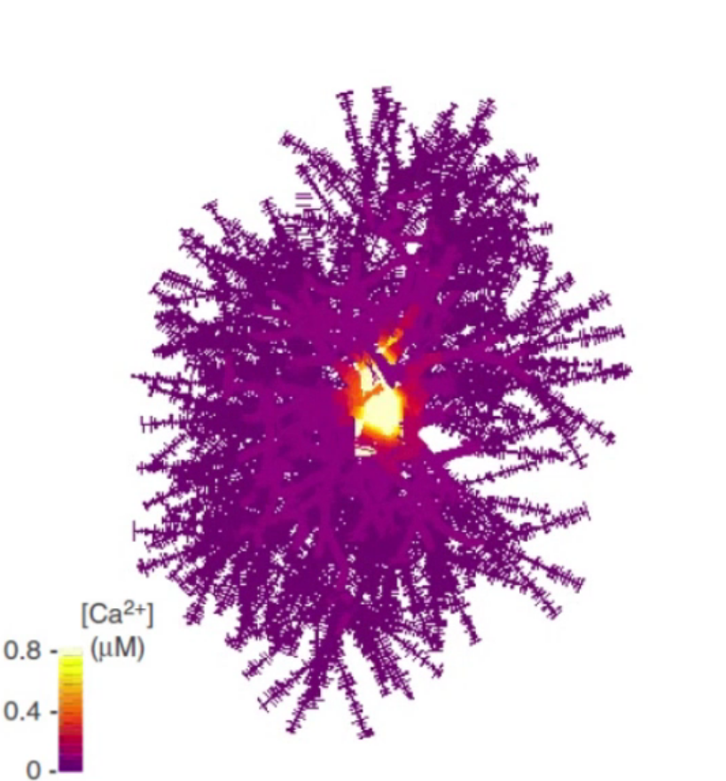

---
# Feel free to add content and custom Front Matter to this file.
# To modify the layout, see https://jekyllrb.com/docs/themes/#overriding-theme-defaults

layout: home
---

<h3> Computational portal for modelling brain cells with stochastic nano-properties and interactive 3D environment.</h3>

<!-- Container for all three tools with videos -->

  <!-- ASTRO -->
  

    

      
<strong><h3>ASTRO</h3></strong> simulates complex realistic astrocytes incorporating their stochastic nanoscopic 
      morphology

    

     
    

      
      <video id="myVideo1" loop muted playsinline>
        <source src="assets/Astro.mp4" type="video/mp4">
      </video>
    

  

  <!-- BRAINCELL -->
  

    

      
<strong><h3>BRAINCELL</h3></strong> simulates brain cell morphology and physiology
      with their stochastic nano-features, dynamic extracellular environment and inter-cellular 

      
 signalling, on the scale from nanometers to hundreds of microns 

    

     
    

      

        

          
          <video id="myVideo2" loop muted playsinline>
            <source src="assets/BrainCellSpine.mp4" type="video/mp4">
          </video>
        

      

      

      

        

          
          <video id="myVideo3" loop muted playsinline>
            <source src="assets/BrainCellGaba.mp4" type="video/mp4">
          </video>
        

      

    

  

  <!-- ARACHNE -->
  

    

      
<strong><h3>ARACHNE</h3></strong> simulates multi-cell spiking neuronal networks with astrocytes, excitation-inhibition, volume transmission, and flexible memory rules 
 
    

    

      
      <video id="myVideo4" loop muted playsinline>
        <source src="assets/Arachne.mp4" type="video/mp4">
      </video>
    

  

